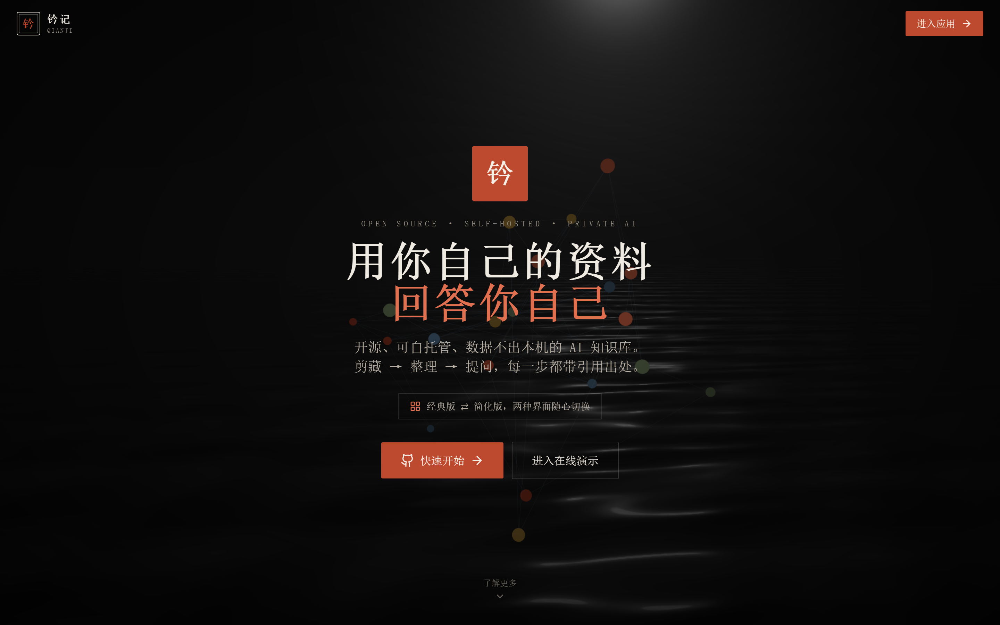
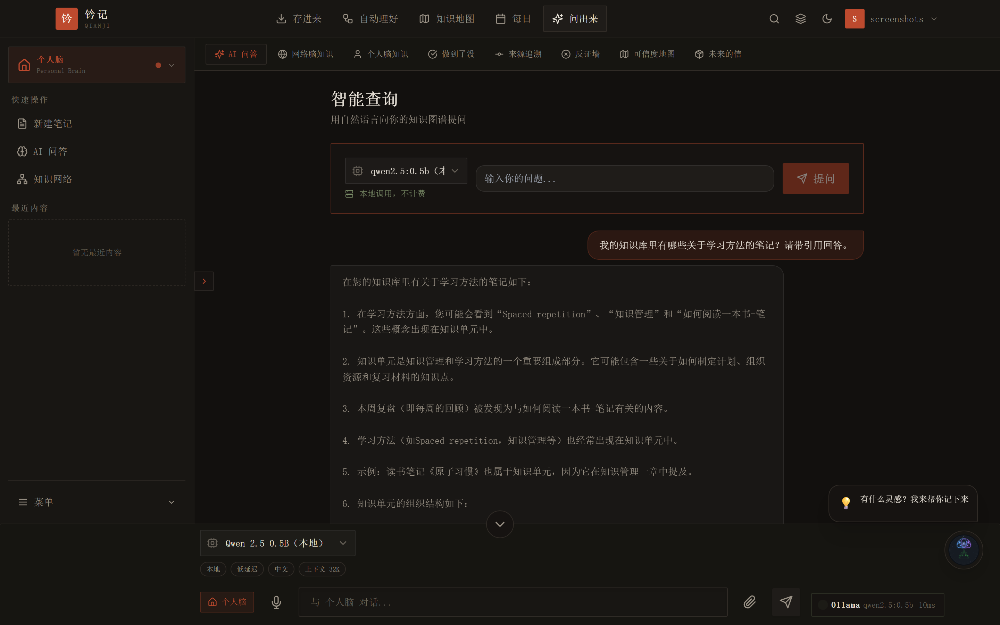
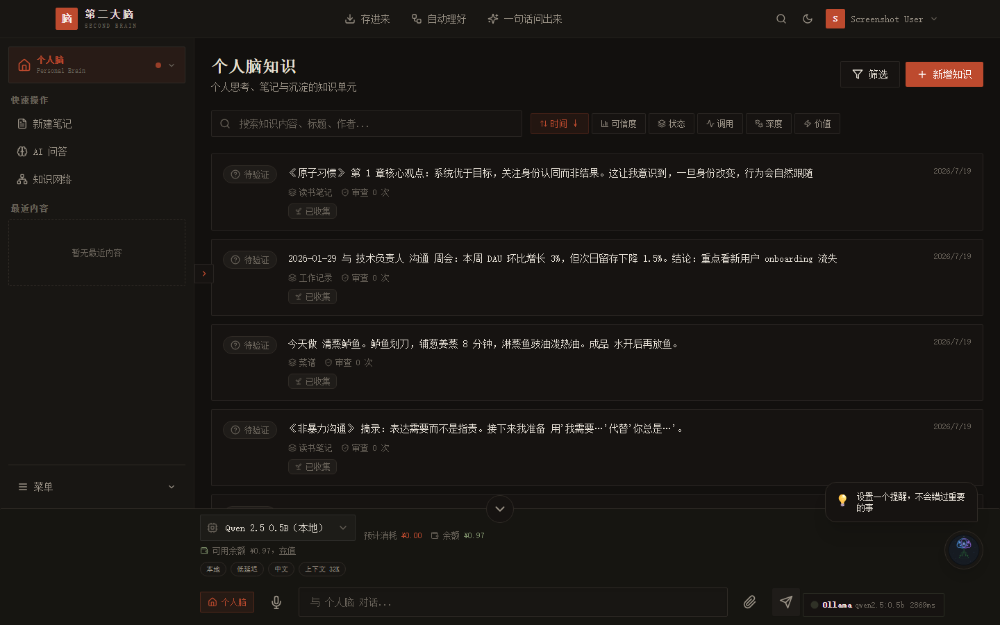

# 个人第二大脑 / Personal Second Brain

> 把零散的知识**存进来**，让 AI 帮你**自动理好**，需要时**一句话问出来**。数据优先留在本机，云模型仅在你填写 API Key 后才会调用。

> Collect scattered knowledge, let AI organize it automatically, and retrieve anything with a single sentence. Data stays on your machine first; cloud models are only called after you provide your own API key.

[](https://www.gnu.org/licenses/agpl-3.0)


[中文](#快速开始) · [English](#quick-start)

---

## 快速开始

```bash
git clone https://github.com/your-org/personal-second-brain.git
cd personal-second-brain
cp backend/.env.example .env
# 编辑 .env，填入强密钥（生产环境必须）
docker compose up -d
```

- 前端：`http://localhost:3000`
- API：`http://localhost:8000`
- API 文档：`http://localhost:8000/docs`

首次启动后，注册一个普通账号，再通过以下命令将其设为管理员：

```bash
cd backend
./.venv/bin/python -m scripts.create_admin user@example.com
```

---

## Quick Start

```bash
git clone https://github.com/your-org/personal-second-brain.git
cd personal-second-brain
cp backend/.env.example .env
# Edit .env and set strong secrets (required for production)
docker compose up -d
```

- Web UI: `http://localhost:3000`
- API: `http://localhost:8000`
- API docs: `http://localhost:8000/docs`

After the first launch, register a regular account, then promote it to admin:

```bash
cd backend
./.venv/bin/python -m scripts.create_admin user@example.com
```

---

## 这是什么 / What is this

**个人第二大脑**是一款面向长期知识工作者的开源全栈工具：

1. **存进来** — 笔记、网页剪藏、文件导入，一键沉淀。
2. **自动理好** — 自动摘要、标签、向量化与关系图谱，让知识可检索。
3. **一句话问出来** — RAG 对话会引用原文出处，本地模型免费跑，云模型按需接入。

核心设计原则：

- **本地优先**：默认使用 SQLite + Ollama，数据不出本机。
- **模型自由**：Ollama、DeepSeek、Kimi、OpenCode 等可配置切换。
- **开源可审计**：AGPL-3.0 协议，服务端代码完全开放。

**Personal Second Brain** is an open-source full-stack tool for long-term knowledge workers:

1. **Capture** — notes, web clips, file imports.
2. **Organize** — auto summary, tags, embeddings, and relationship graph.
3. **Retrieve** — RAG chat with source citations; free local models, optional cloud models.

Core principles:

- **Local-first**: SQLite + Ollama by default; data stays on your machine.
- **Model freedom**: Ollama, DeepSeek, Kimi, OpenCode, and more.
- **Open & auditable**: AGPL-3.0, server code fully open.

---

## 界面版本：经典版 ⇄ 简化版 / Two Interface Modes

应用内置两套界面，顶栏图标一键切换，选择会被记住：

- **经典版（默认）**：完整 12 个功能模块——素材采集、认知生产管线、注意力管家、涌现工作室、知识图谱、反脆弱知识库、时间胶囊、认知镜像、社会大脑、具身认知、社区、设置。
- **简化版**：只保留三个核心动作「存进来 → 自动理好 → 一句话问出来」+ 社区 + 设置，界面更干净，适合新手上手。

切换入口：顶栏主题按钮旁的版本图标，或「设置 → 外观 → 界面版本」。数据完全共用，只是导航与功能入口的显隐，随时可切回。

The app ships with two interface modes, switchable from the top navigation bar (your choice is remembered):

- **Classic (default)**: the full 12 modules — capture, pipeline, attention, emergence studio, knowledge graph, antifragile knowledge base, time capsules, cognitive mirror, social brain, embodied cognition, community, and settings.
- **Simple**: only the three core actions — capture → organize → retrieve — plus community and settings. A cleaner UI for getting started.

Both modes share the same data; only navigation and feature entries differ. Switch anytime from the top bar or **Settings → Appearance → Interface Version**.

---

## 功能截图 / Screenshots

| 首页 | 仪表盘（空状态引导） |
|------|----------------------|
|  |  |

| RAG 问答（本地模型 + 引用出处） | 个人知识库 |
|--------------------------------|----------------------|
|  |  |

---

## 与同类工具对比 / Comparison

| 能力 | 个人第二大脑 | Obsidian | ima.copilot |
|------|-------------|----------|-------------|
| 本地模型免费跑 | ✅ Ollama | 需插件 | ❌ |
| RAG 引用原文 | ✅ | 需插件 | 部分支持 |
| 网页剪藏 | ✅ | 需插件 | ✅ |
| 数据完全本地 | ✅ 默认 | ✅ | ❌ |
| 服务端开源 | ✅ AGPL-3.0 | 客户端闭源 | 闭源 |
| 多模型路由 | ✅ | 插件实现 | 部分 |
| 自托管成本 | 低（SQLite + CPU） | 仅客户端 | 依赖官方 |

---

## 技术栈 / Tech Stack

- **Frontend**: React 19 + Vite + TypeScript + Tailwind CSS + Zustand
- **Backend**: FastAPI + Pydantic v2 + SQLAlchemy + Alembic
- **Database**: SQLite（默认）/ PostgreSQL（生产）
- **Vector DB**: ChromaDB
- **Local LLM**: Ollama
- **Desktop**: Electron + 内嵌后端 sidecar
- **Deploy**: Docker Compose + Nginx

---

## 开发 / Development

```bash
# 后端 / Backend
cd backend
python -m venv .venv
source .venv/bin/activate  # Windows: .venv\Scripts\activate
pip install -r requirements.txt
cp .env.example .env
uvicorn app.main:app --reload --port 8000

# 前端 / Frontend
cd frontend
npm install
npm run dev
```

浏览器扩展与桌面端用法见 [docs/guide/getting-started.md](docs/guide/getting-started.md)。

---

## 文档 / Documentation

- [快速开始](docs/guide/getting-started.md)
- [自托管部署](docs/guide/self-host.md)
- [模型配置](docs/guide/model-setup.md)
- [对比分析](docs/comparison.md)
- [贡献指南](.github/CONTRIBUTING.md)

---

## 路线图 / Roadmap

- [x] 本地优先的笔记与剪藏
- [x] RAG 对话与本地模型支持
- [x] 多模型路由与按 token 计费
- [x] 桌面端（Electron + 内嵌后端）
- [ ] 浏览器扩展上架
- [ ] 移动端 PWA
- [ ] 插件市场与公开 API
- [ ] 协作空间（多人知识库）

---

## 安全 / Security

如发现安全漏洞，请发邮件至 **security@grzhishiku.com**，不要公开提交 Issue。

Please report security issues to **security@grzhishiku.com** instead of opening public issues.

---

## 许可证 / License

[AGPL-3.0](LICENSE) © 2024-2026 Personal Second Brain Contributors

**商标声明**："个人第二大脑"、"第二大脑"、"Personal Second Brain"、"grzhishiku.com" 及相关 LOGO 不随代码授权，详见 [TRADEMARK.md](TRADEMARK.md)。

---

> ⭐ 如果这个项目对你有帮助，请给我们一个 Star！
> 
> If this project helps you, please give us a star!
