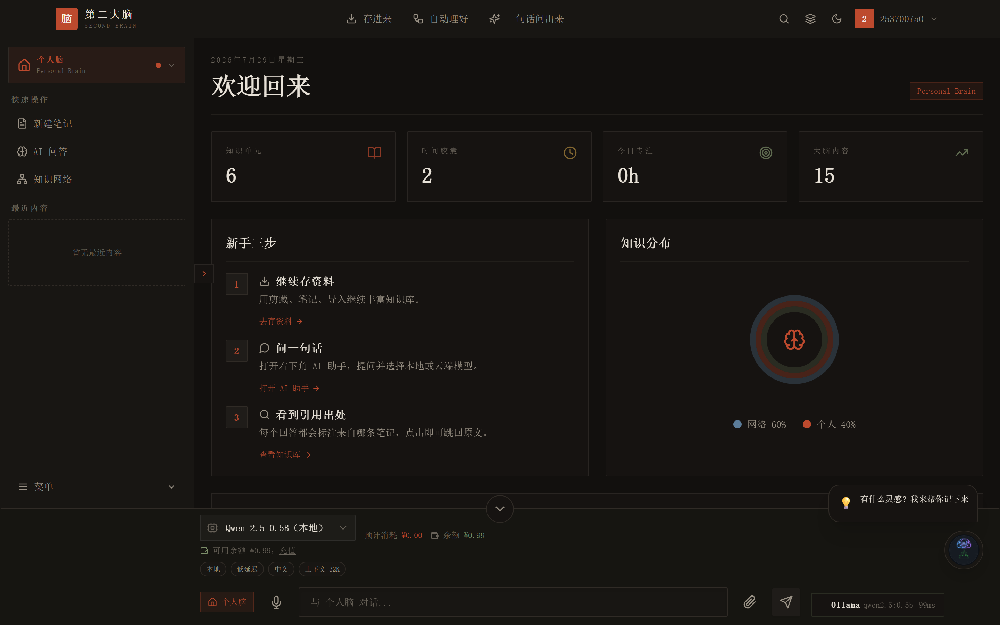

# 个人第二大脑（Personal Second Brain）

> 一座属于你的私人认知圣殿：把零散的记忆、灵感、阅读与思考，沉淀成可生长、可验证、可对话的知识网络，并用 AI 放大你的脑力。

[](LICENSE)


---

## 这是什么

**个人第二大脑**是一套面向长期知识工作者的全栈工具。它不止于笔记与剪藏，更试图回答：

- 如何让今天读到的文章，三年后还能被精确找到并重新激活？
- 如何区分"收藏了"与"真正理解了"？
- 如何用 AI 不是替代思考，而是照见自己的思维盲区？
- 如何把注意力从信息洪流中夺回，投入到真正重要的事上？

在这里，每一条笔记、每一次剪藏、每一个时间胶囊、每一段深度工作记录，都会汇入同一个可检索、可验证、可可视化的认知图谱。你可以与自己的过去对话，也可以让多模型共同验证一个观点的真伪。

## 视觉体验

本项目采用沉浸式的**液体玻璃（Liquid Glass）**设计语言：

- **月夜涟漪**、**丝绸流场**、**雨落寒窗**三种动态 WebGL 背景，登录页即进入专注氛围。
- 磨砂玻璃面板、微光边框与琥珀色强调色，营造宁静而高级的思考空间。
- 支持 **深色 / 浅色 / 跟随系统** 一键切换，适配不同光线与心情。

---

## 功能特性

| 功能 | 说明 | 状态 |
|------|------|------|
| 📝 智能笔记 | Markdown 编辑器 + AI 自动摘要 + 标签管理 | ✅ |
| 🔗 浏览器剪藏 | 一键保存网页，自动提取正文与元数据 | ✅ |
| 🧠 反脆弱知识库 | AI 验证知识可信度，来源追溯与偏差检测 | ✅ |
| ⏳ 时间胶囊 | 封存记忆，设定未来解锁条件，跨时空对话 | ✅ |
| 🎯 注意力管家 | 深度工作模式、时间追踪、专注度评分 | ✅ |
| 🔍 认知镜像 | 思维指纹画像、认知偏差检测、反思建议 | ✅ |
| ✨ 涌现工作室 | 跨域联想、创意碰撞、概念杂交、反事实探索 | ✅ |
| 🌐 知识图谱 | 双脑知识可视化、自动关联、路径查找 | ✅ |
| 🔎 融合搜索 | 同时搜索个人脑与网络脑，相关性排序 | ✅ |
| 🤖 AI 对话 | 流式 LLM 对话，智能路由（Ollama / OpenAI / Anthropic） | ✅ |
| 💳 计费系统 | 多套餐、多支付渠道（支付宝 / 微信 / Stripe） | ✅ |
| 🔐 安全加固 | XSS 防护、CSRF 防护、Rate Limiting、输入校验 | ✅ |
| 📊 监控告警 | Prometheus 指标、健康检查、日志轮转 | ✅ |

---

## 技术栈

### 前端
- **React 19** + **Vite** + **TypeScript**
- **Tailwind CSS** 暗色主题（GitHub 风格）
- **Zustand** 状态管理
- **React Query** 服务端缓存
- **Recharts** + **D3.js** 数据可视化
- **Framer Motion** 交互动效

### 后端
- **FastAPI** + **Pydantic v2** + **Uvicorn**
- **SQLAlchemy** ORM + **SQLite**（默认）/ **PostgreSQL**（生产）
- **Alembic** 数据库迁移
- **python-jose** JWT 认证 + **bcrypt** 密码哈希
- **Redis** 缓存（可选）
- **Prometheus Client** 指标暴露

### 基础设施
- **Docker** + **Docker Compose**
- **Nginx** 反向代理 + 静态文件服务
- **Let's Encrypt** SSL 自动续期
- **Prometheus** + **Grafana** 监控（可选）

---

## 快速开始

### 方式一：Docker 一键启动（推荐）

```bash
# 1. 克隆仓库
git clone https://github.com/your-org/personal-second-brain.git
cd personal-second-brain

# 2. 配置环境变量
cp backend/.env.example .env
# 编辑 .env：修改 SECRET_KEY、ADMIN_SECRET_KEY 等

# 3. 启动全部服务
docker-compose up -d

# 4. 访问服务
# 前端: http://localhost:3000
# API:  http://localhost:8000
# 文档: http://localhost:8000/docs
```

### 方式二：本地开发

**后端**
```bash
cd backend
python -m venv .venv
source .venv/bin/activate  # Windows: .venv\Scripts\activate
pip install -r requirements.txt
cp .env.example .env
uvicorn app.main:app --reload --port 8000
```

**前端**
```bash
cd frontend
npm install
npm run dev
# 打开 http://localhost:3000
```

**浏览器扩展**
```bash
cd browser-extension
npm install
npm run build
# Chrome 扩展管理页加载 dist/ 目录
```

**桌面端（Electron + 内嵌后端）**

桌面端是自包含应用：Electron 主进程启动时自动拉起内嵌的 FastAPI 后端
（`127.0.0.1` 动态端口，同源托管 API 与前端页面），托盘常驻，
`Ctrl+Shift+N` 全局唤起快记。数据存在系统用户目录（`%APPDATA%/个人第二大脑/data`）。

**安装（推荐）**：`desktop/release/个人第二大脑 Setup x.y.z.exe` —— 引导式安装，
可自选安装目录/盘符（免管理员），自动创建桌面与开始菜单快捷方式。
`desktop/release/` 下的 portable 单文件版仅作备用（每次启动解压到临时目录，
易被安全软件/清理工具干扰）。

```bash
cd desktop
npm install

# 开发模式 A（推荐）：内嵌后端 + 源码后端，一键起全栈
npm run dev:embedded

# 开发模式 B：前端热更新 —— 先启动前端 dev server 和后端，再
set PSB_WEB_URL=http://127.0.0.1:3000
npm run dev

# 打包 Windows 安装包与便携版（前端构建 + PyInstaller 冻结后端 + electron-builder）
# 前置：backend/.venv 已装依赖，且 pip install pyinstaller 已装入该 venv
npm run dist     # 输出在 desktop/release/
```

冒烟自检（主进程 + 后端 sidecar 启动后立即退出）：

```bash
npm run smoke
```

---

## 测试账号

| 角色 | 邮箱 | 密码 |
|------|------|------|
| 管理员 | admin@test.com | __TEST_ADMIN_PASSWORD__ |
| 普通用户 | user@test.com | __TEST_USER_PASSWORD__ |

> ⚠️ 仅用于开发测试，生产环境请立即删除或修改密码。

---

## 截图

> 
> 
> 
> 

*（截图目录：`screenshots/`，请补充实际运行截图）*

---

## 项目结构

```
.
├── backend/              # FastAPI 后端
│   ├── app/
│   │   ├── api/          # API 路由 (v1 + admin)
│   │   ├── core/         # 配置、数据库、安全
│   │   ├── models/       # SQLAlchemy 模型
│   │   ├── schemas/      # Pydantic 数据模型
│   │   ├── services/     # 业务逻辑 (LLM, 支付)
│   │   └── utils/        # 工具函数
│   ├── alembic/          # 数据库迁移
│   ├── tests/            # 单元测试
│   ├── Dockerfile
│   └── requirements.txt
├── frontend/             # React 前端
│   ├── src/
│   ├── public/
│   ├── scripts/debug/    # 调试截图与检查脚本
│   ├── Dockerfile
│   └── nginx.conf
├── browser-extension/    # 浏览器扩展
├── desktop/              # 桌面端（Electron + 内嵌后端 sidecar，托盘/全局快捷键）
├── docs/                 # 文档
│   ├── design/           # 架构设计文档
│   ├── plans/            # 迭代计划
│   ├── DEPLOYMENT.md     # 通用部署指南
│   ├── DEPLOYMENT.prod.md# 生产部署文档
│   ├── OPERATIONS.md
│   └── USER_GUIDE.md
├── monitoring/           # Prometheus + Grafana 配置
├── nginx/                # 反向代理与 SSL 配置
├── scripts/              # 本地工具脚本（Ollama 等）
├── docker-compose.yml    # 内测部署
├── docker-compose.prod.yml
└── README.md
```

---

## 文档

- [API 文档](backend/API.md) — 全部端点说明
- [部署指南](docs/DEPLOYMENT.md) — Docker、SSL、环境变量
- [运维手册](docs/OPERATIONS.md) — 日常检查、故障排查、备份恢复
- [用户手册](docs/USER_GUIDE.md) — 功能指南、FAQ、快捷键

交互式 API 文档（启动后访问）：
- Swagger UI: `http://localhost:8000/docs`
- ReDoc: `http://localhost:8000/redoc`

---

## 贡献指南

### 开发流程

1. Fork 仓库并创建分支：`git checkout -b feat/your-feature`
2. 提交代码：`git commit -m "feat: add amazing feature"`
3. 推送分支：`git push origin feat/your-feature`
4. 创建 Pull Request，描述改动和测试方法

### 提交规范

采用 [Conventional Commits](https://www.conventionalcommits.org/)：

| 类型 | 说明 |
|------|------|
| `feat` | 新功能 |
| `fix` | Bug 修复 |
| `docs` | 文档更新 |
| `style` | 代码格式（不影响功能） |
| `refactor` | 重构 |
| `perf` | 性能优化 |
| `test` | 测试相关 |
| `chore` | 构建/工具链 |

### 代码规范

- 后端：PEP 8，使用 `black` 和 `ruff` 格式化与检查（`make format` / `make lint`）
- 前端：ESLint，TypeScript 严格模式（`npm run lint` / `npm run typecheck`）
- 所有新功能需附带单元测试（覆盖率 ≥ 80%）

---

## 商业化计费

Phase 1 已实现 LLM 调用按 token 计费：

- 新用户注册赠送 1 元试用余额
- 调用前冻结余额，调用后按实际 token 结算
- 支持支付宝 / 微信 / Stripe 模拟充值与 webhook 到账
- Admin 可管理模型目录与上游厂商账户

详细说明见 [`backend/docs/llm-billing.md`](backend/docs/llm-billing.md)。

---

## 性能目标

| 指标 | 目标 | 实测 |
|------|------|------|
| 首屏加载 | < 2s | 未测量 |
| API P95 响应 | < 500ms | 未测量 |
| Lighthouse Performance | > 90 | 未测量 |
| Lighthouse Accessibility | > 90 | 未测量 |
| 单元测试覆盖率 | ≥ 80% | 53%（2026-07-16，`pytest --cov=app`，123 项测试全绿） |
| 后端镜像大小 | < 500MB | 未测量 |
| 前端镜像大小 | < 100MB | 未测量 |

> 覆盖率距 80% 目标尚有差距，优先为 `services/` 层（当前约 60-73%）补充测试；CI 已产出每次提交的覆盖率报告。

---

## 安全

本项目已通过以下安全实践：
- ✅ 输入长度限制和类型校验（Pydantic `max_length`）
- ✅ XSS 防护（HTML 转义 + 安全响应头）
- ✅ CSRF 防护（SameSite Cookie + TrustedHost）
- ✅ Rate Limiting（slowapi，分端点限流）
- ✅ 密码安全（bcrypt，最小 8 位 + 复杂度）
- ✅ SQL 注入防护（SQLAlchemy ORM 参数化查询）
- ✅ CORS 白名单限制

安全报告：security@example.com

---

## 许可证

[MIT License](LICENSE) © 2024 Personal Second Brain Contributors

---

## 鸣谢

- [FastAPI](https://fastapi.tiangolo.com/) — 现代 Python Web 框架
- [React](https://react.dev/) — 前端 UI 库
- [Tailwind CSS](https://tailwindcss.com/) — 实用优先 CSS 框架
- [Ollama](https://ollama.com/) — 本地 LLM 运行
- [Zustand](https://github.com/pmndrs/zustand) — 轻量状态管理
- [Recharts](https://recharts.org/) — React 图表库
- [Framer Motion](https://www.framer.com/motion/) — 动效库

---

> ⭐ 如果这个项目对你有帮助，请给我们一个 Star！

> 🚀 欢迎提交 Issue 和 PR，一起构建更好的个人知识管理系统！
